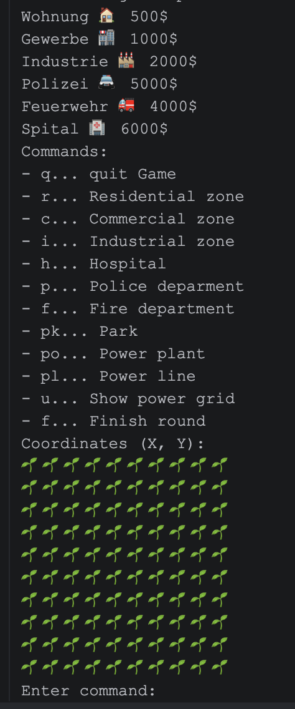

# SimCity

SimCity is a simple console-based city building game written in Java.

The game creates a city map filled with empty green cells. 
The player can enter commands and coordinates to place different types of buildings on the map, such as residential zones, commercial zones, industrial zones, hospitals, police departments, fire departments, parks, power plants, and power lines.

Each building is shown with an emoji symbol, and the updated city map is printed in the console after every move. The game also prevents players from building outside the map or placing a building on an occupied cell.

## Features

- 10x10 console game board
- Different building types with names, prices, and symbols
- Command-based building placement
- Coordinate validation
- Occupied-cell validation
- Gradle project setup

## Commands

- `r` - Residential zone
- `c` - Commercial zone
- `i` - Industrial zone
- `h` - Hospital
- `p` - Police department
- `f` - Fire department
- `pk` - Park
- `po` - Power plant
- `pl` - Power line
- `q` - Quit the game



## How to Run

Use Gradle to start the application:

```bash
./gradlew run
```

On Windows:

```bash
gradlew.bat run
```

## Project Structure

- `Main.java` starts the game and handles user input.
- `Game.java` creates and updates the game board.
- `BuildingType.java` is the base class for building types.
- `Wohnung.java`, `Gewerbe.java`, `Industrie.java`, and `Infastruktur.java` define specific building categories.
- `ShowInfo.java` defines how building information is displayed.
